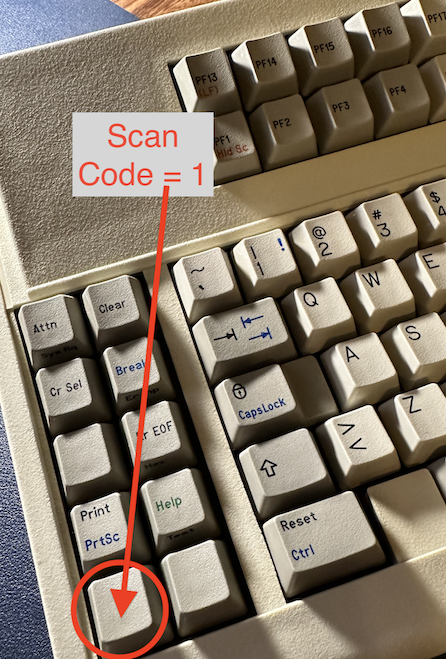

# Terminal Session Reset
As of this writing, the current official version of OEC lacks support for multiple sessions on a single terminal or to allow terminals to connect to different hosts.

However, I currently have OEC connected to an IBM 3299 terminal multiplexer, which allows control of multiple terminals. Each terminal needs to connect to different hosts. Additionally, some terminals may need to disconnect and reconnect to another host.

Initially, I setup [proxy3270](https://github.com/racingmars/proxy3270) to present a menu of available hosts. Unfortunately, once a terminal connected to a host, there was no easy way to disconnect from the host and return to the proxy3270 panel. I could force it to disconnect and return to the proxy3270 panel via the following methods:

* Power cycle the terminal, which causes unwanted stress to aging power supplies and capacitors.
* Disconnect and reconnect the coax cable between the terminal and the 3299 multiplexer. Constantly connecting and disconnecting a coax should be avoided to prevent damage to connectors and cables.
* Force the terminal into "offline setup" and then back online. This isn't acceptable as it is cumbersome.

This experimental branch is a compromise and interim workaround until OEC adds official support for multiple sessions. I have added a check for the scancode 1, which, on the 122-key keyboard, is the bottom left key.   

The `device_lost` event is raised when pressed, causing the controller to invalidate the session. When the controller next polls for connected terminals, it rediscovers the terminal and initiates a new session.

When OEC is pointing to a [proxy3270](https://github.com/racingmars/proxy3270) host and the key is pressed, OEC creates a new session, presenting the host list again.
